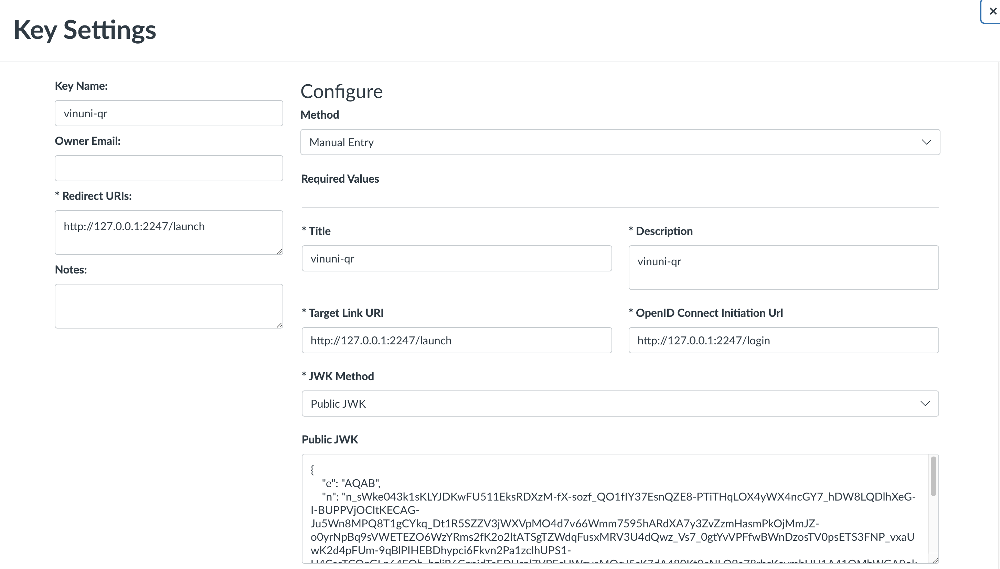
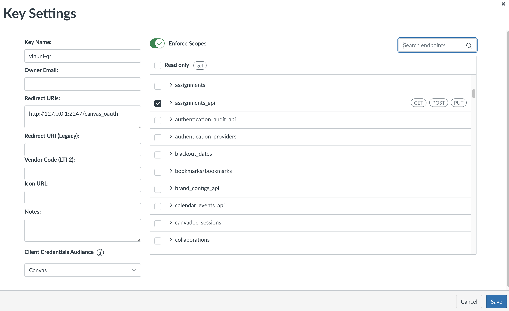
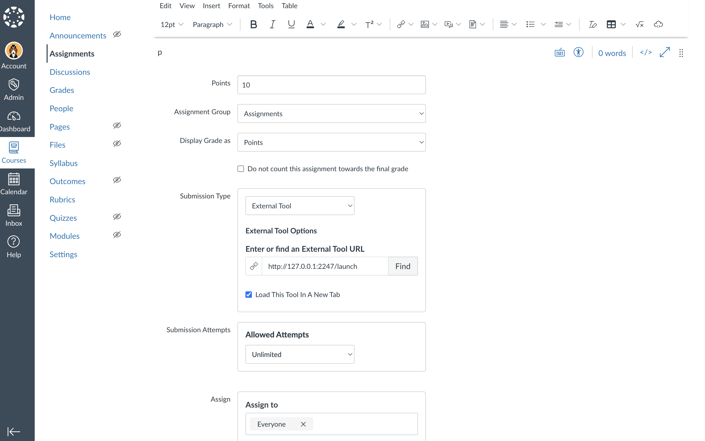

# VinUni QR Attendance LTI App
VinUni QR Attendance is an Attendance Management System made by VinUnians for VinUniversity with an aim to replace the
default Roll Call Attendance provided by Canvas.

# Table of Contents
- [Prerequesites](#prerequesites)
- [Features](#vinuni-qr-attendance-lti-app)
- [Installation](#installation)
- [Acknowledgement](#-acknowledgement)

## Prerequesites
As this app integrates with Canvas for getting Course, Section, Assignment, Student, Grade, etc
information, you need to set up your Canvas server and provide the app with API key and LTI key.

For local development, you can host your own Canvas server using [this tutorial](https://github.com/instructure/canvas-lms/wiki/Quick-Start)

You can configure the LTI key, API key, and Assignment Submission type using the Tool as below (replace the Redirect URI with the base URL of the tool):




## Features
### For Instructor:
- Select and launch the web application as an External Tool
in the Assignment selection section of Canvas Course
- Automatically retrieve the course enrollments for different sections of current course (opened from Assignment)
- Start a check-in session, display QR code for checking. The
configuration for checking (such as Timer) can be configured
- Has a view of attendance history of the course sections
- Can manually edit the attendance status of each section and
update the score to Canvas accordingly and automatically
### For Student:
- Select and launch the web application as an External Tool in
the Assignment section
- Open the check-in section to open the camera view for scanning QR
attendance code
- See their attendance history with grades

## Installation
### Fill in environment variables
Create a .env file in the root directory of the project and fill in the following environment variables:
```shell
SQLALCHEMY_DATABASE_URI = ""

APP_SECRET_KEY = ""

CANVAS_URL = ""
CANVAS_API_KEY = ""

LTI_URL = ""
LTI_CLIENT_ID = ""
LTI_DEPLOYMENT_ID = ""
LTI_TOOL_NAME = ""
```

### Quick Running
We recommend using Docker for quick running. You can use the following command to run the app:
```shell
docker compose up -d build
```
The app will be running at `http://localhost:2247`

### Requirements

- Python 3.9+
- MySQL 8+

### Set up virtual environment

```shell
pip install virtualenv
virtualenv venv
source ./venv/bin/activate
```

### Install dependencies

```shell
pip install -r requirements-dev.txt
```

#### Install `pre-commit` hooks
- Install `pre-commit` hooks:
  ```shell
  pre-commit install
  ```

### Running

#### Running MySQL to initialize database 
#### Run these lines in `mysql` server
```shell
create database attendance;  
use attendance;
```

#### Setting up database with Flask Migration
```shell
flask db init
flask db migrate
flask db upgrade
```

Inside the virtual environment, run

```shell
python run.py
```

###  Testing
```shell
ENVIRONMENT=test pytest
```

### Get Coverage Report
```shell
ENVIRONMENT=test coverage run -m pytest
coverage html
```

## Acknowledgement
This is a thank you note for the teaching team of COMP2030 - Software Construction@VinUni for helping us during the course
as well as Professor Daniel Ruelle - our client for this project - for his dedicated support!